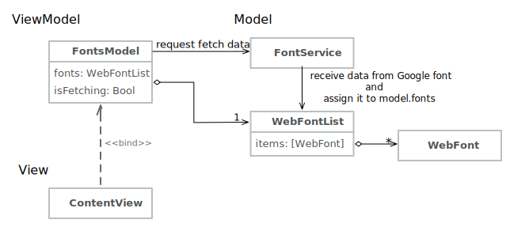

# Google Font Viewer Design

Goole Font Viewer is based on MVVM. 
The following sections will explain the componenets used in it respectively.

## Model

The model involves two parts -- how to get fonts from google, and how to store those.
Google Font Viewer get fonts through *FontService*, and put those into a *WebFontList*.

### Data Model
#### WebFont and WebFontList
The WebFont is designed to store needed information of a web font. With those information, developer can apply web font on html/css content without preloading it.
The WebFontList is a container of WebFont, it has a array to store WebFont.
Both structures conform to Codable which reduces the effort to convert JSON to class manually.

#### WebFont+Preview
This extension file wraps processes to convert WebFont into html context. The convert rule is based on [Google Fonts CSS API](https://developers.google.com/fonts/docs/css2)


### Google API Service/Proxy
#### FontService
This enum class represents and communicates with the remote Google Fonts Developer API.
The provides the method fetchData() to request fonts from Google.
Since the only responsiblity of FontService is request data from Google, it don't need any storage. Also, it does not need to have multiple services. So I declare it as enum class to save the size, and to avoid it be misused. 

## ViewModel
### FontsModel
This is the ViewModel. It publishes two objects -- WebFontList and isFetching. 
The WebFontList is bound to a List, and the isFetching determines when to show progress view.

## View
With NavigationView and NavigationLink, Google Font Viewer shows a master-detail design easily.

### ContentView
It's the master view, which includes a segmented picker to switch different sorting methods, and a list to show all fonts.

### FontDetail
The detail view to show more information about the selected font.




## Other Tools
### Apply
The concept of *apply* is taken from **Kotlin**. I use it to setup WKWebView, and avoid to write lots of view modifier.

### DictionaryBuilder
This custom attribute help us build dictionary with more flexible syntax, for example, to build dictionary with different condition.

Traditionally, building different dictionaries depending on some conditions might look like:
```swift
var dict:[String: String] = []
if buildMore {
    dict = ["key": "value", "key2": "value2"]
} else {
    dict = ["key": "value"]
}
``` 

With DictionaryBuilder, it can be written as:
```swift
let dict = builder {
    ["key": "value"]
    if buildMore {
        ["key2": "value2"]
    }
}
```
or 
```swift
let dict = builder {
    ("key", "value")
    if buildMore {
        ("key2", "value2")
    }
}
```

### SegmentedPicker
It's a custom view modifier to quick setup segmented picker.

