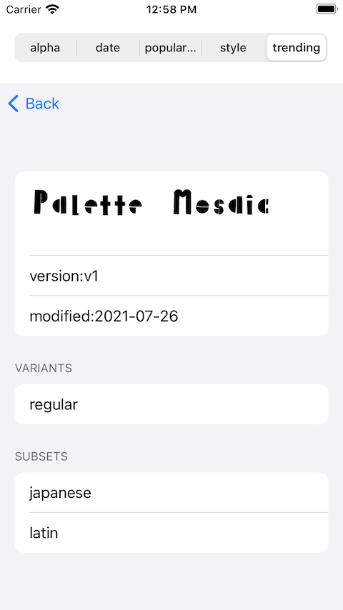

This is PicCollage take home Quiz.

The result of **Question 1** is a SwiftUI app project. and the answer of **Problem** is written on a swift playground -- [CountNumber7](#problem-containing-7s).

---

## Question 1: GoogleFontViewer

#### Previews

---
#### Question 2: [Design of GoogleFontViewer](Design.md)

---
#### Problem: Containing 7s
[CountNumber7](CountNumber7.playground/Contents.swift)
